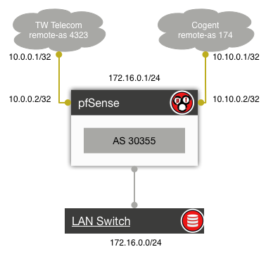
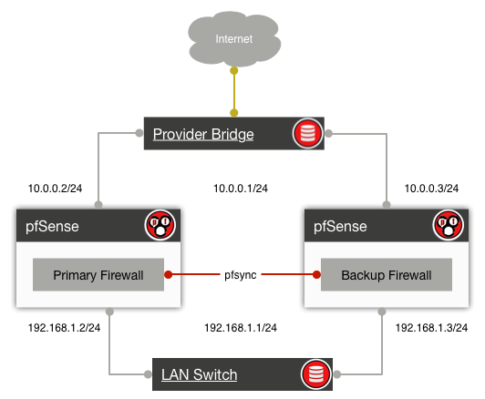
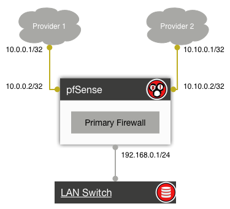

.. -*- coding: utf-8 -*-

...  Copyright 2016 Six Feet Up, Inc.

     Licensed under the Apache License, Version 2.0 (the "License");
     you may not use this file except in compliance with the License.
     You may obtain a copy of the License at

         http://www.apache.org/licenses/LICENSE-2.0

     Unless required by applicable law or agreed to in writing, software
     distributed under the License is distributed on an "AS IS" BASIS,
     WITHOUT WARRANTIES OR CONDITIONS OF ANY KIND, either express or implied.
     See the License for the specific language governing permissions and
     limitations under the License.

:title: Introduction to the pfSense Open Source Firewall and Router
:event: CINLUG Feb 2016
:author: Calvin Hendryx-Parker
:pygments: tango
:css: custom.css

.. |space| unicode:: 0xA0 .. non-breaking space
.. |br| raw:: html

     

----

Introduction to the pfSense Open Source Firewall and Router
============================================================

----

Your Presenter
==============

Calvin Hendryx-Parker, CTO
++++++++++++++++++++++++++

Six Feet Up, Inc.
-----------------

.. note::

    Introduce yourself, why are you the person they should be listening to for
    the next 45 minutes

----

What is pfSense?
================

.. note::

    What is a security appliance

    examples Juniper SRX, SonicWall, Checkpoint

----

Why do you want to use it?
==========================

----

How do you get pfSense?
=======================

* Live CD or USB Memstick with Installer (32 and 64 bit versions)
* Embedded via NanoBSD (Serial or VGA Consoles)

https://www.pfsense.org/download/

----

What can you do with pfSense?
=============================

----

Router/NAT
==========

* 1:1 NAT
* Port forwards
* Outbound NAT
* NAT Reflection

----

BGP Routing
===========

----

Firewall
========

* Filtering (source, destination, protocols, etc) 
* Packet normalization
* Transparent Layer 2 Filtering
* Limit connections and resource usages
* QoS and Traffic Shaping
* logging
* routing policies for custom gateways on a per rule basis
* all rules are stateful by default
  
.. note:: 

    Large State Tables - State table entries require about 1 KB of RAM each. The default state table size is calculated based on 10% of the available RAM in the firewall. For example, a firewall with 1 GB of RAM will default to 100,000 states which when full would use about 100 MB of RAM. For large environments requiring state tables with several hundred thousand connections, or millions of connections, ensure adequate RAM is available.

    why we ditched Juniper story

----

High Availability
=================

----

Multi WAN
=========

----

VPN Concentrator
================

* IPSec
* OpenVPN
* PPTP (do not use this!)

.. note::
    
    VPN - Heavy use of any of the VPN services included in the pfSense software will increase CPU requirements. Encrypting and decrypting traffic is CPU intensive. The number of connections is much less of a concern than the throughput required. AES-NI acceleration of IPsec significantly reduces CPU requirements on platforms that support it.

----

Other Features
==============

Captive Portal
++++++++++++++

DHCP Server and Relay
+++++++++++++++++++++

PPPoE Server with optional RADIUS support
+++++++++++++++++++++++++++++++++++++++++

.. note:: 
    
    Captive Portal - While the primary concern is typically throughput, environments with hundreds of simultaneous captive portal users (of which there are many) will require slightly more CPU power than recommended above.

----

Third Party Add-on Packages
===========================

* OpenBGPd
* AutoConfigBackup (Gold Subscription)
* ntop
* snort, darkstat
* Asterisk, FreeSwitch and sipproxd
* HAProxy, Varnish, squidGuard, DansGuardian

.. note::
    
    Packages - Some of the packages increase RAM requirements significantly. Snort and ntop are two that should not be installed on a system with less than 1GB RAM.

----

Questions?
==========

